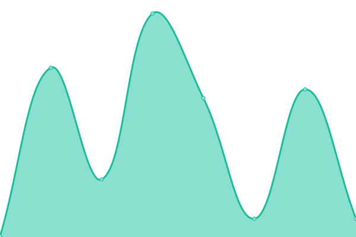
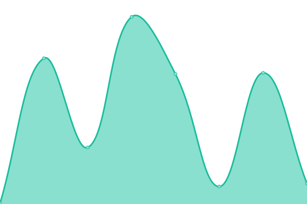
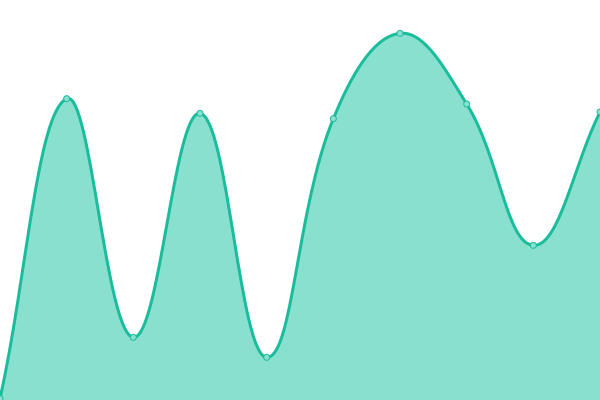

# [📈 Live Status](https://upptime.github.io/upptime): <!--live status--> **🟩 All systems operational**

This repository contains the open-source uptime monitor and status page for [Upptime](https://upptime.js.org), powered by [Upptime](https://github.com/upptime/upptime).

With [Upptime](https://upptime.js.org), you can get your own unlimited and free uptime monitor and status page, powered entirely by a GitHub repository. We use [Issues](https://github.com/upptime/upptime/issues) as incident reports, [Actions](https://github.com/unosquare/upptime/actions) as uptime monitors, and [Pages](https://upptime.github.io/upptime) for the status page.

<!--start: status pages-->
<!-- This summary is generated by Upptime (https://github.com/upptime/upptime) -->
<!-- Do not edit this manually, your changes will be overwritten -->
<!-- prettier-ignore -->
| URL | Status | History | Response Time | Uptime |
| --- | ------ | ------- | ------------- | ------ |
|  Core | 🟩 Up | [core.yml](https://github.com/unosquare/upptime/commits/HEAD/history/core.yml) | 

 264ms
     
 | 

<a href="https://status.unosquare.com/history/core">100.00%</a>
    

|  Workflow | 🟩 Up | [workflow.yml](https://github.com/unosquare/upptime/commits/HEAD/history/workflow.yml) | 

 161ms
     
 | 

<a href="https://status.unosquare.com/history/workflow">100.00%</a>
    

|  Billing | 🟩 Up | [billing.yml](https://github.com/unosquare/upptime/commits/HEAD/history/billing.yml) | 

 157ms
     
 | 

<a href="https://status.unosquare.com/history/billing">100.00%</a>
    

|  Graph | 🟩 Up | [graph.yml](https://github.com/unosquare/upptime/commits/HEAD/history/graph.yml) | 

 164ms
     
 | 

<a href="https://status.unosquare.com/history/graph">100.00%</a>
    

|  Function Core | 🟩 Up | [function-core.yml](https://github.com/unosquare/upptime/commits/HEAD/history/function-core.yml) | 

 196ms
     
 | 

<a href="https://status.unosquare.com/history/function-core">100.00%</a>
    

|  Function Billing | 🟩 Up | [function-billing.yml](https://github.com/unosquare/upptime/commits/HEAD/history/function-billing.yml) | 

 169ms
     
 | 

<a href="https://status.unosquare.com/history/function-billing">100.00%</a>
    

|  Workflow Functions | 🟩 Up | [workflow-functions.yml](https://github.com/unosquare/upptime/commits/HEAD/history/workflow-functions.yml) | 

 168ms
     
 | 

<a href="https://status.unosquare.com/history/workflow-functions">100.00%</a>
    

|  Uno Subsystem | 🟩 Up | [uno-subsystem.yml](https://github.com/unosquare/upptime/commits/HEAD/history/uno-subsystem.yml) | 

 2558ms
     
 | 

<a href="https://status.unosquare.com/history/uno-subsystem">100.00%</a>
    

|  Talent Matching (Unosquare OS) | 🟩 Up | [talent-matching-unosquare-os.yml](https://github.com/unosquare/upptime/commits/HEAD/history/talent-matching-unosquare-os.yml) | 

 160ms
     
 | 

<a href="https://status.unosquare.com/history/talent-matching-unosquare-os">100.00%</a>
    

|  Identity (Unosquare OS) | 🟩 Up | [identity-unosquare-os.yml](https://github.com/unosquare/upptime/commits/HEAD/history/identity-unosquare-os.yml) | 

 155ms
     
 | 

<a href="https://status.unosquare.com/history/identity-unosquare-os">100.00%</a>
    

|  Workflows (Unosquare OS) | 🟩 Up | [workflows-unosquare-os.yml](https://github.com/unosquare/upptime/commits/HEAD/history/workflows-unosquare-os.yml) | 

 155ms
     
 | 

<a href="https://status.unosquare.com/history/workflows-unosquare-os">100.00%</a>
    

<!--end: status pages-->

[**Visit our status website →**](https://upptime.github.io/upptime)

## 📄 License

- Powered by: [Upptime](https://github.com/upptime/upptime)
- Code: [MIT](./LICENSE) © [Anand Chowdhary](https://anandchowdhary.com), supported by [Pabio](https://pabio.com)
- Data in the `./history` directory: [Open Database License](https://opendatacommons.org/licenses/odbl/1-0/)
