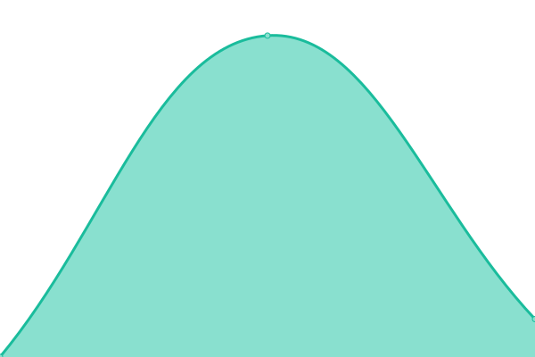
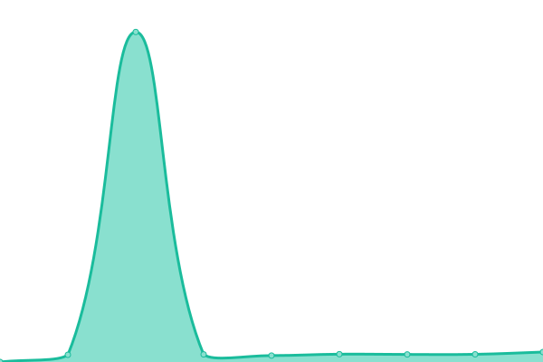

# [📈 Live Status](https://upptime.github.io/upptime): <!--live status--> **🟧 Partial outage**

This repository contains the open-source uptime monitor and status page for [Upptime](https://upptime.js.org), powered by [Upptime](https://github.com/upptime/upptime).

With [Upptime](https://upptime.js.org), you can get your own unlimited and free uptime monitor and status page, powered entirely by a GitHub repository. We use [Issues](https://github.com/upptime/upptime/issues) as incident reports, [Actions](https://github.com/upptime/upptime/actions) as uptime monitors, and [Pages](https://upptime.github.io/upptime) for the status page.

<!--start: status pages-->
<!-- This summary is generated by Upptime (https://github.com/upptime/upptime) -->
<!-- Do not edit this manually, your changes will be overwritten -->

| URL                                                                           | Status  | History                                                                                                                | Response Time                                                                                | Uptime                                                                                                                                                                                                                                             |
| ----------------------------------------------------------------------------- | ------- | ---------------------------------------------------------------------------------------------------------------------- | -------------------------------------------------------------------------------------------- | -------------------------------------------------------------------------------------------------------------------------------------------------------------------------------------------------------------------------------------------------- |
| [ClientCore](http://clientcore.unosquare.com/)                                | 🟩 Up   | [client-core.yml](https://github.com/unosquare/upptime/commits/master/history/client-core.yml)                         |  150ms             |                          |
| [TimeCore](https://timecore.unosquare.com/)                                   | 🟩 Up   | [time-core.yml](https://github.com/unosquare/upptime/commits/master/history/time-core.yml)                             |  428ms               |                              |
| [Exec Reports](http://reports.unosquare.com/)                                 | 🟩 Up   | [exec-reports.yml](https://github.com/unosquare/upptime/commits/master/history/exec-reports.yml)                       |  145ms            |                        |
| [Core API Health](https://coreapi.azurewebsites.net/health)                   | 🟥 Down | [core-api-health.yml](https://github.com/unosquare/upptime/commits/master/history/core-api-health.yml)                 |  1478ms        |                    |
| [Core ELP API Health](https://elpapi.azurewebsites.net/health)                | 🟩 Up   | [core-elp-api-health.yml](https://github.com/unosquare/upptime/commits/master/history/core-elp-api-health.yml)         |  128ms     |          |
| [Core API Staging Health](https://unocoreapistaging.azurewebsites.net/health) | 🟩 Up   | [core-api-staging-health.yml](https://github.com/unosquare/upptime/commits/master/history/core-api-staging-health.yml) |  273ms |  |
| [Core ELP API Health](https://elpstaging.azurewebsites.net/health)            | 🟩 Up   | [core-elp-api-health.yml](https://github.com/unosquare/upptime/commits/master/history/core-elp-api-health.yml)         |  128ms     |          |

<!--end: status pages-->

[**Visit our status website →**](https://upptime.github.io/upptime)

## 📄 License

- Powered by: [Upptime](https://github.com/upptime/upptime)
- Code: [MIT](./LICENSE) © [Upptime](https://upptime.js.org)
- Data in the `./history` directory: [Open Database License](https://opendatacommons.org/licenses/odbl/1-0/)
