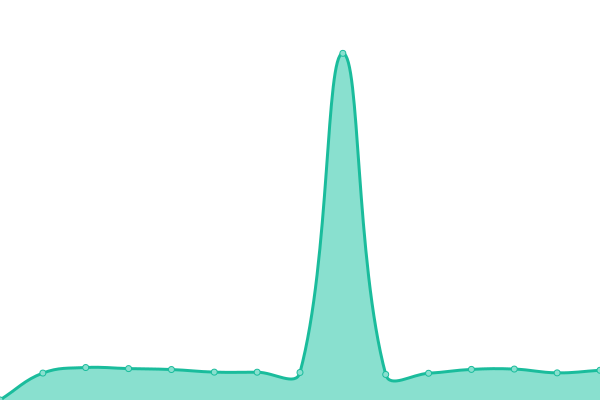
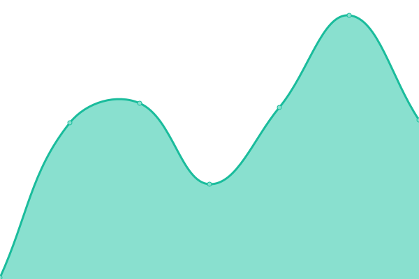
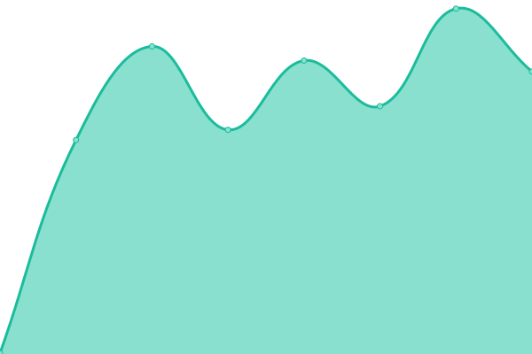
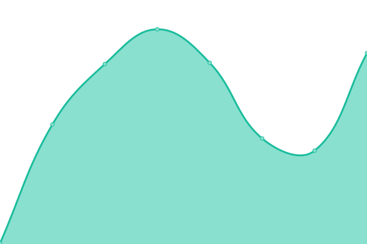
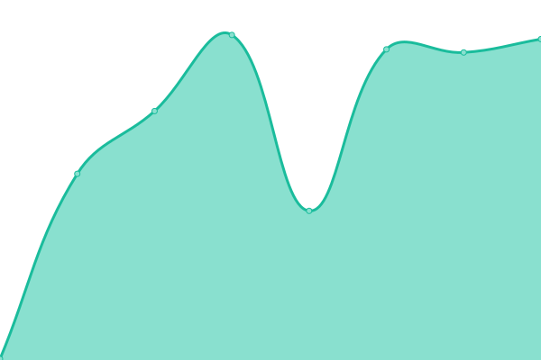
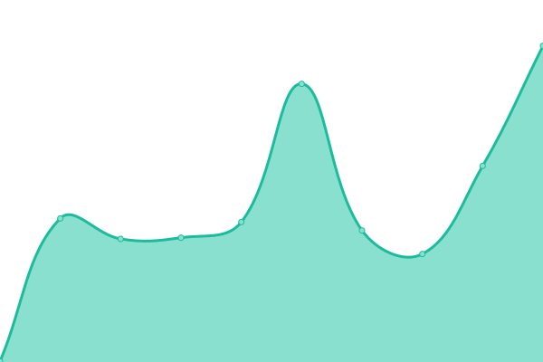
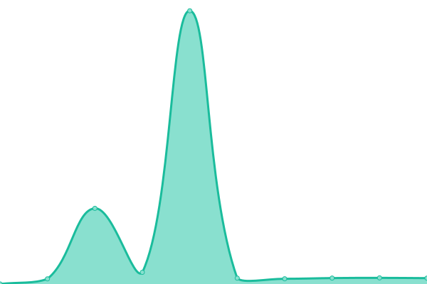
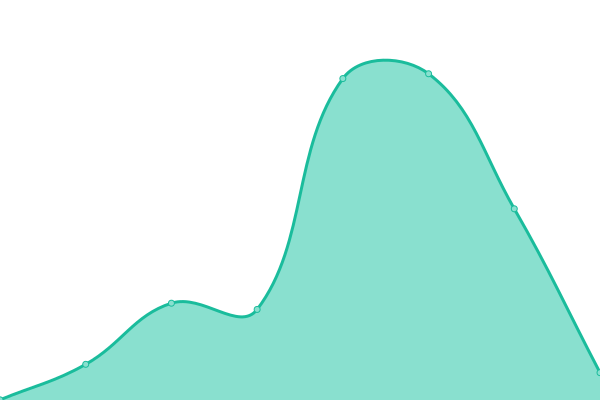
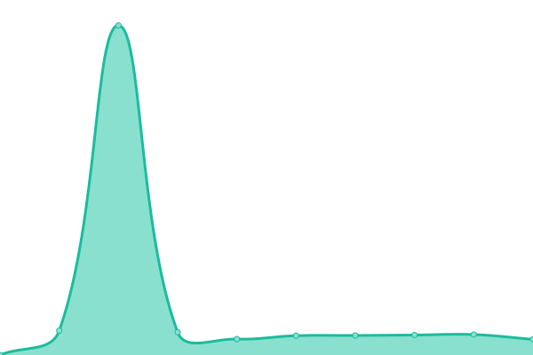

# [📈 Live Status](https://upptime.github.io/upptime): <!--live status--> **🟧 Partial outage**

This repository contains the open-source uptime monitor and status page for [Upptime](https://upptime.js.org), powered by [Upptime](https://github.com/upptime/upptime).

With [Upptime](https://upptime.js.org), you can get your own unlimited and free uptime monitor and status page, powered entirely by a GitHub repository. We use [Issues](https://github.com/upptime/upptime/issues) as incident reports, [Actions](https://github.com/upptime/upptime/actions) as uptime monitors, and [Pages](https://upptime.github.io/upptime) for the status page.

<!--start: status pages-->
<!-- This summary is generated by Upptime (https://github.com/upptime/upptime) -->
<!-- Do not edit this manually, your changes will be overwritten -->
<!-- prettier-ignore -->
| URL | Status | History | Response Time | Uptime |
| --- | ------ | ------- | ------------- | ------ |
|  [ClientCore](http://clientcore.unosquare.com/) | 🟩 Up | [client-core.yml](https://github.com/unosquare/upptime/commits/HEAD/history/client-core.yml) | 

 240ms
     
 | 

<a href="https://unosquare.github.io/upptime/history/client-core">100.00%</a>
    

|  [TimeCore](https://timecore.unosquare.com/) | 🟩 Up | [time-core.yml](https://github.com/unosquare/upptime/commits/HEAD/history/time-core.yml) | 

 449ms
     
 | 

<a href="https://unosquare.github.io/upptime/history/time-core">100.00%</a>
    

|  [Exec Reports](http://reports.unosquare.com/) | 🟩 Up | [exec-reports.yml](https://github.com/unosquare/upptime/commits/HEAD/history/exec-reports.yml) | 

 235ms
     
 | 

<a href="https://unosquare.github.io/upptime/history/exec-reports">100.00%</a>
    

|  [Interviews](https://interviews.unosquare.com/) | 🟩 Up | [interviews.yml](https://github.com/unosquare/upptime/commits/HEAD/history/interviews.yml) | 

 159ms
     
 | 

<a href="https://unosquare.github.io/upptime/history/interviews">100.00%</a>
    

|  [Core API Health](https://unocoreapi.azurewebsites.net/health) | 🟩 Up | [core-api-health.yml](https://github.com/unosquare/upptime/commits/HEAD/history/core-api-health.yml) | 

 365ms
     
 | 

<a href="https://unosquare.github.io/upptime/history/core-api-health">100.00%</a>
    

|  [Core ELP API Health](https://elpapi.azurewebsites.net/health) | 🟩 Up | [core-elp-api-health.yml](https://github.com/unosquare/upptime/commits/HEAD/history/core-elp-api-health.yml) | 

 292ms
     
 | 

<a href="https://unosquare.github.io/upptime/history/core-elp-api-health">100.00%</a>
    

|  [Core Client API Health](https://clientcore.azurewebsites.net/health) | 🟩 Up | [core-client-api-health.yml](https://github.com/unosquare/upptime/commits/HEAD/history/core-client-api-health.yml) | 

 291ms
     
 | 

<a href="https://unosquare.github.io/upptime/history/core-client-api-health">100.00%</a>
    

|  [Core Exec API Health](https://execapi.azurewebsites.net/health) | 🟩 Up | [core-exec-api-health.yml](https://github.com/unosquare/upptime/commits/HEAD/history/core-exec-api-health.yml) | 

 294ms
     
 | 

<a href="https://unosquare.github.io/upptime/history/core-exec-api-health">100.00%</a>
    

|  [Core AI API Health](https://coreai.azurewebsites.net/health) | 🟩 Up | [core-ai-api-health.yml](https://github.com/unosquare/upptime/commits/HEAD/history/core-ai-api-health.yml) | 

 355ms
     
 | 

<a href="https://unosquare.github.io/upptime/history/core-ai-api-health">100.00%</a>
    

|  [Core SharePoint Reporting API Health](https://ssrapi.azurewebsites.net/health) | 🟩 Up | [core-share-point-reporting-api-health.yml](https://github.com/unosquare/upptime/commits/HEAD/history/core-share-point-reporting-api-health.yml) | 

 280ms
     
 | 

<a href="https://unosquare.github.io/upptime/history/core-share-point-reporting-api-health">0.00%</a>
    

|  [Core API Staging Health](https://unocoreapistaging.azurewebsites.net/health) | 🟩 Up | [core-api-staging-health.yml](https://github.com/unosquare/upptime/commits/HEAD/history/core-api-staging-health.yml) | 

 2566ms
     
 | 

<a href="https://unosquare.github.io/upptime/history/core-api-staging-health">100.00%</a>
    

|  [Core ELP API Staging Health](https://elpstaging.azurewebsites.net/health) | 🟩 Up | [core-elp-api-staging-health.yml](https://github.com/unosquare/upptime/commits/HEAD/history/core-elp-api-staging-health.yml) | 

 293ms
     
 | 

<a href="https://unosquare.github.io/upptime/history/core-elp-api-staging-health">100.00%</a>
    

|  [Core Client API Staging Health](https://clientstaging.azurewebsites.net/health) | 🟥 Down | [core-client-api-staging-health.yml](https://github.com/unosquare/upptime/commits/HEAD/history/core-client-api-staging-health.yml) | 

 1375ms
     
 | 

<a href="https://unosquare.github.io/upptime/history/core-client-api-staging-health">100.00%</a>
    

|  [Core AI API Staging Health](https://coreaistaging.azurewebsites.net/health) | 🟩 Up | [core-ai-api-staging-health.yml](https://github.com/unosquare/upptime/commits/HEAD/history/core-ai-api-staging-health.yml) | 

 1707ms
     
 | 

<a href="https://unosquare.github.io/upptime/history/core-ai-api-staging-health">100.00%</a>
    

|  [Core SharePoint Reporting API Staging Health](https://srrstaging.azurewebsites.net/health) | 🟩 Up | [core-share-point-reporting-api-staging-health.yml](https://github.com/unosquare/upptime/commits/HEAD/history/core-share-point-reporting-api-staging-health.yml) | 

 309ms
     
 | 

<a href="https://unosquare.github.io/upptime/history/core-share-point-reporting-api-staging-health">100.00%</a>
    

<!--end: status pages-->

[**Visit our status website →**](https://upptime.github.io/upptime)

## 📄 License

- Powered by: [Upptime](https://github.com/upptime/upptime)
- Code: [MIT](./LICENSE) © [Upptime](https://upptime.js.org)
- Data in the `./history` directory: [Open Database License](https://opendatacommons.org/licenses/odbl/1-0/)
