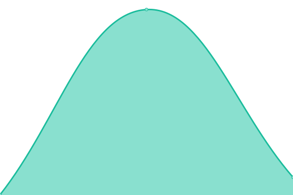
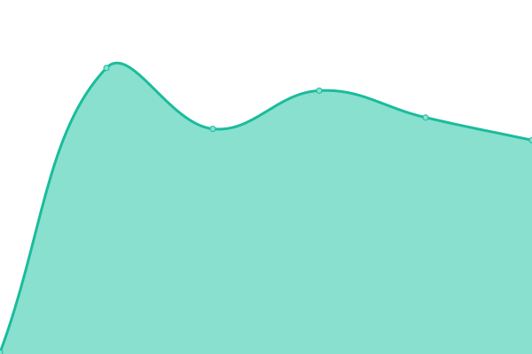

# [📈 Live Status](https://upptime.github.io/upptime): <!--live status--> **🟩 All systems operational**

This repository contains the open-source uptime monitor and status page for [Upptime](https://upptime.js.org), powered by [Upptime](https://github.com/upptime/upptime).

With [Upptime](https://upptime.js.org), you can get your own unlimited and free uptime monitor and status page, powered entirely by a GitHub repository. We use [Issues](https://github.com/upptime/upptime/issues) as incident reports, [Actions](https://github.com/upptime/upptime/actions) as uptime monitors, and [Pages](https://upptime.github.io/upptime) for the status page.

<!--start: status pages-->
<!-- This summary is generated by Upptime (https://github.com/upptime/upptime) -->
<!-- Do not edit this manually, your changes will be overwritten -->
<!-- prettier-ignore -->
| URL | Status | History | Response Time | Uptime |
| --- | ------ | ------- | ------------- | ------ |
| [ClientCore](http://clientcore.unosquare.com/) | 🟩 Up | [client-core.yml](https://github.com/unosquare/upptime/commits/master/history/client-core.yml) | 

 166ms
     
 | 

   

| [TimeCore](https://timecore.unosquare.com/) | 🟩 Up | [time-core.yml](https://github.com/unosquare/upptime/commits/master/history/time-core.yml) | 

 866ms
     
 | 

   

| [Exec Reports](http://reports.unosquare.com/) | 🟩 Up | [exec-reports.yml](https://github.com/unosquare/upptime/commits/master/history/exec-reports.yml) | 

 129ms
     
 | 

   

| [Interviews](https://interviews.unosquare.com/) | 🟩 Up | [interviews.yml](https://github.com/unosquare/upptime/commits/master/history/interviews.yml) | 

 265ms
     
 | 

   

| [Core API Health](https://unocoreapi.azurewebsites.net/health) | 🟩 Up | [core-api-health.yml](https://github.com/unosquare/upptime/commits/master/history/core-api-health.yml) | 

 626ms
     
 | 

   

| [Core ELP API Health](https://elpapi.azurewebsites.net/health) | 🟩 Up | [core-elp-api-health.yml](https://github.com/unosquare/upptime/commits/master/history/core-elp-api-health.yml) | 

 566ms
     
 | 

   

| [Core Client API Health](https://clietcore.azurewebsites.net/health) | 🟩 Up | [core-client-api-health.yml](https://github.com/unosquare/upptime/commits/master/history/core-client-api-health.yml) | 

 282ms
     
 | 

   

| [Core API Staging Health](https://unocoreapistaging.azurewebsites.net/health) | 🟩 Up | [core-api-staging-health.yml](https://github.com/unosquare/upptime/commits/master/history/core-api-staging-health.yml) | 

 191ms
     
 | 

   

| [Core ELP API Staging Health](https://elpstaging.azurewebsites.net/health) | 🟩 Up | [core-elp-api-staging-health.yml](https://github.com/unosquare/upptime/commits/master/history/core-elp-api-staging-health.yml) | 

 168ms
     
 | 

   

| [Core Client API Staging Health](https://clientstaging.azurewebsites.net/health) | 🟩 Up | [core-client-api-staging-health.yml](https://github.com/unosquare/upptime/commits/master/history/core-client-api-staging-health.yml) | 

 163ms
     
 | 

   

<!--end: status pages-->

[**Visit our status website →**](https://upptime.github.io/upptime)

## 📄 License

- Powered by: [Upptime](https://github.com/upptime/upptime)
- Code: [MIT](./LICENSE) © [Upptime](https://upptime.js.org)
- Data in the `./history` directory: [Open Database License](https://opendatacommons.org/licenses/odbl/1-0/)
