# [📈 Live Status](https://upptime.github.io/upptime): <!--live status--> **🟩 All systems operational**

This repository contains the open-source uptime monitor and status page for [Upptime](https://upptime.js.org), powered by [Upptime](https://github.com/upptime/upptime).

With [Upptime](https://upptime.js.org), you can get your own unlimited and free uptime monitor and status page, powered entirely by a GitHub repository. We use [Issues](https://github.com/upptime/upptime/issues) as incident reports, [Actions](https://github.com/unosquare/upptime/actions) as uptime monitors, and [Pages](https://upptime.github.io/upptime) for the status page.

<!--start: status pages-->
<!-- This summary is generated by Upptime (https://github.com/upptime/upptime) -->
<!-- Do not edit this manually, your changes will be overwritten -->
<!-- prettier-ignore -->
| URL | Status | History | Response Time | Uptime |
| --- | ------ | ------- | ------------- | ------ |
|  API · Core (legacy) | 🟩 Up | [core.yml](https://github.com/unosquare/upptime/commits/HEAD/history/core.yml) | 

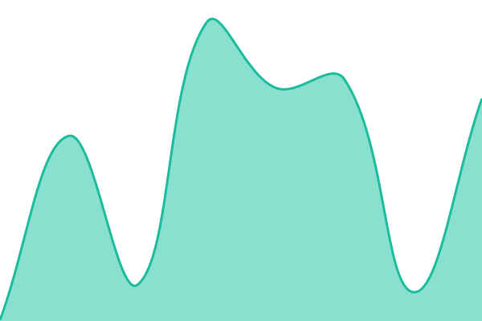 176ms
     
 | 

<a href="https://status.unosquare.com/history/core">100.00%</a>
    

|  API · CoreGraph | 🟩 Up | [graph.yml](https://github.com/unosquare/upptime/commits/HEAD/history/graph.yml) | 

 126ms
     
 | 

<a href="https://status.unosquare.com/history/graph">100.00%</a>
    

|  API · ActionItems | 🟩 Up | [api-action-items.yml](https://github.com/unosquare/upptime/commits/HEAD/history/api-action-items.yml) | 

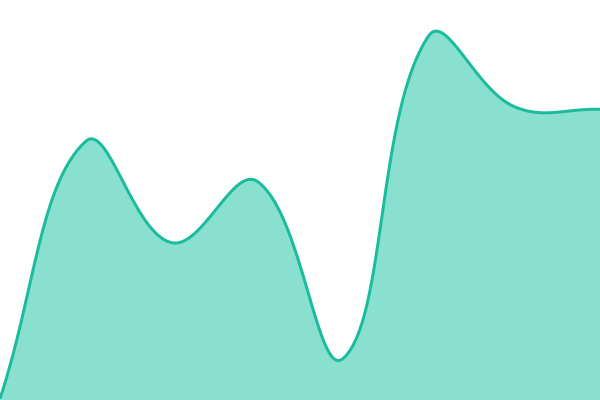 134ms
     
 | 

<a href="https://status.unosquare.com/history/api-action-items">100.00%</a>
    

|  API · ATS | 🟩 Up | [api-ats.yml](https://github.com/unosquare/upptime/commits/HEAD/history/api-ats.yml) | 

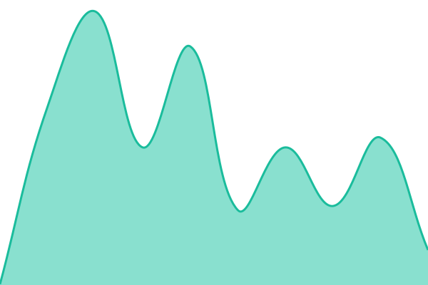 122ms
     
 | 

<a href="https://status.unosquare.com/history/api-ats">100.00%</a>
    

|  API · AuditTrail | 🟩 Up | [api-audit-trail.yml](https://github.com/unosquare/upptime/commits/HEAD/history/api-audit-trail.yml) | 

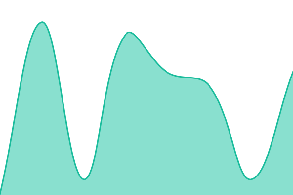 122ms
     
 | 

<a href="https://status.unosquare.com/history/api-audit-trail">100.00%</a>
    

|  API · Discussions | 🟩 Up | [api-discussions.yml](https://github.com/unosquare/upptime/commits/HEAD/history/api-discussions.yml) | 

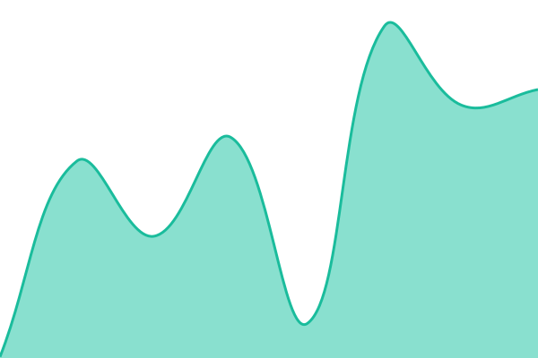 125ms
     
 | 

<a href="https://status.unosquare.com/history/api-discussions">100.00%</a>
    

|  API · Identity | 🟩 Up | [identity-unosquare-os.yml](https://github.com/unosquare/upptime/commits/HEAD/history/identity-unosquare-os.yml) | 

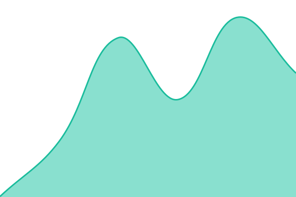 120ms
     
 | 

<a href="https://status.unosquare.com/history/identity-unosquare-os">100.00%</a>
    

|  API · OneOnOnes | 🟩 Up | [api-one-on-ones.yml](https://github.com/unosquare/upptime/commits/HEAD/history/api-one-on-ones.yml) | 

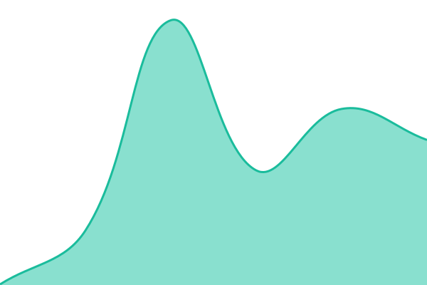 118ms
     
 | 

<a href="https://status.unosquare.com/history/api-one-on-ones">100.00%</a>
    

|  API · Settings | 🟩 Up | [api-settings.yml](https://github.com/unosquare/upptime/commits/HEAD/history/api-settings.yml) | 

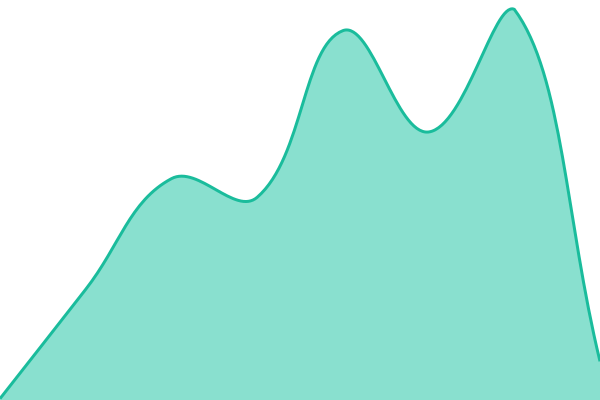 132ms
     
 | 

<a href="https://status.unosquare.com/history/api-settings">100.00%</a>
    

|  API · TalentMatching | 🟩 Up | [talent-matching-unosquare-os.yml](https://github.com/unosquare/upptime/commits/HEAD/history/talent-matching-unosquare-os.yml) | 

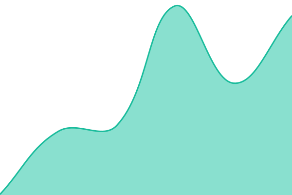 121ms
     
 | 

<a href="https://status.unosquare.com/history/talent-matching-unosquare-os">100.00%</a>
    

|  API · Workflows | 🟩 Up | [workflows-unosquare-os.yml](https://github.com/unosquare/upptime/commits/HEAD/history/workflows-unosquare-os.yml) | 

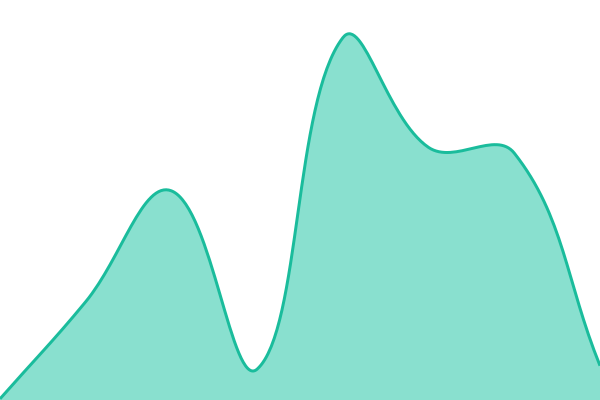 118ms
     
 | 

<a href="https://status.unosquare.com/history/workflows-unosquare-os">100.00%</a>
    

|  Reports · Exec API | 🟩 Up | [workflow.yml](https://github.com/unosquare/upptime/commits/HEAD/history/workflow.yml) | 

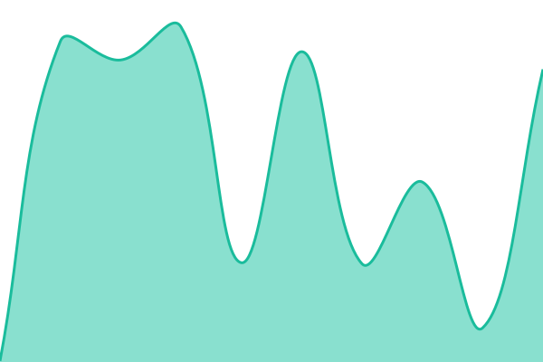 151ms
     
 | 

<a href="https://status.unosquare.com/history/workflow">100.00%</a>
    

|  Reports · Billing API | 🟩 Up | [billing.yml](https://github.com/unosquare/upptime/commits/HEAD/history/billing.yml) | 

 119ms
     
 | 

<a href="https://status.unosquare.com/history/billing">100.00%</a>
    

|  Reports · RDLC | 🟩 Up | [reports-rdlc.yml](https://github.com/unosquare/upptime/commits/HEAD/history/reports-rdlc.yml) | 

 151ms
     
 | 

<a href="https://status.unosquare.com/history/reports-rdlc">100.00%</a>
    

|  Reports · FunctionCore (Xero ETL) | 🟩 Up | [function-core.yml](https://github.com/unosquare/upptime/commits/HEAD/history/function-core.yml) | 

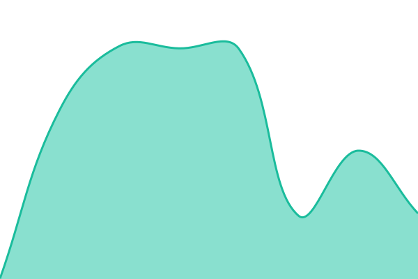 212ms
     
 | 

<a href="https://status.unosquare.com/history/function-core">100.00%</a>
    

|  Worker · Workflow.Functions | 🟩 Up | [workflow-functions.yml](https://github.com/unosquare/upptime/commits/HEAD/history/workflow-functions.yml) | 

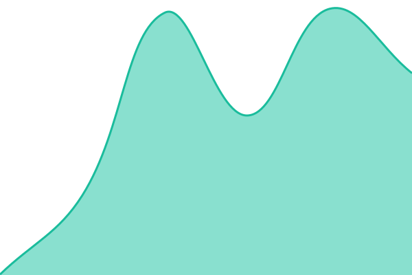 204ms
     
 | 

<a href="https://status.unosquare.com/history/workflow-functions">100.00%</a>
    

|  Worker · Notifications.Functions | 🟩 Up | [worker-notifications-fn.yml](https://github.com/unosquare/upptime/commits/HEAD/history/worker-notifications-fn.yml) | 

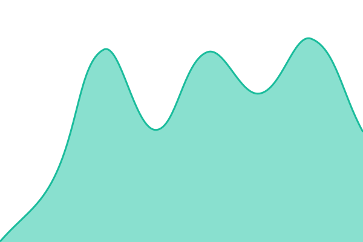 187ms
     
 | 

<a href="https://status.unosquare.com/history/worker-notifications-fn">100.00%</a>
    

|  Worker · TME.Functions | 🟩 Up | [worker-tme-fn.yml](https://github.com/unosquare/upptime/commits/HEAD/history/worker-tme-fn.yml) | 

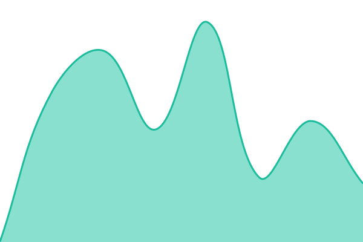 197ms
     
 | 

<a href="https://status.unosquare.com/history/worker-tme-fn">100.00%</a>
    

|  [Web · OS Shell](https://os.unosquare.com) | 🟩 Up | [web-os-shell.yml](https://github.com/unosquare/upptime/commits/HEAD/history/web-os-shell.yml) | 

 220ms
     
 | 

<a href="https://status.unosquare.com/history/web-os-shell">100.00%</a>
    

|  [Web · Billing](https://billing.unosquare.com) | 🟩 Up | [web-billing.yml](https://github.com/unosquare/upptime/commits/HEAD/history/web-billing.yml) | 

 175ms
     
 | 

<a href="https://status.unosquare.com/history/web-billing">100.00%</a>
    

|  [Web · Assignment](https://assignment.unosquare.com) | 🟩 Up | [web-assignment.yml](https://github.com/unosquare/upptime/commits/HEAD/history/web-assignment.yml) | 

 189ms
     
 | 

<a href="https://status.unosquare.com/history/web-assignment">100.00%</a>
    

|  [Web · Reports](https://reports.unosquare.com) | 🟩 Up | [web-reports.yml](https://github.com/unosquare/upptime/commits/HEAD/history/web-reports.yml) | 

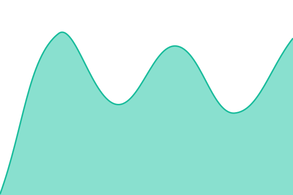 186ms
     
 | 

<a href="https://status.unosquare.com/history/web-reports">100.00%</a>
    

|  [Web · Core Dashboard](https://core.unosquare.com) | 🟩 Up | [web-core-dashboard.yml](https://github.com/unosquare/upptime/commits/HEAD/history/web-core-dashboard.yml) | 

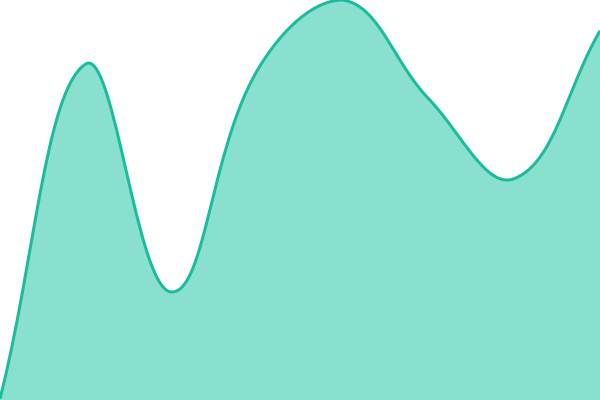 186ms
     
 | 

<a href="https://status.unosquare.com/history/web-core-dashboard">100.00%</a>
    

|  [Web · NomiCore (payroll)](https://nomicore.unosquare.com) | 🟩 Up | [web-nomicore.yml](https://github.com/unosquare/upptime/commits/HEAD/history/web-nomicore.yml) | 

 185ms
     
 | 

<a href="https://status.unosquare.com/history/web-nomicore">100.00%</a>
    

|  Web · Workflows Studio | 🟩 Up | [web-workflows-studio.yml](https://github.com/unosquare/upptime/commits/HEAD/history/web-workflows-studio.yml) | 

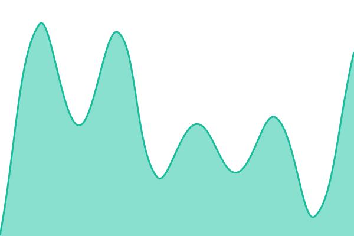 116ms
     
 | 

<a href="https://status.unosquare.com/history/web-workflows-studio">100.00%</a>
    

|  [Web · APR Survey (satellite)](https://survey.unosquare.com) | 🟩 Up | [apr-survey-satellite.yml](https://github.com/unosquare/upptime/commits/HEAD/history/apr-survey-satellite.yml) | 

 182ms
     
 | 

<a href="https://status.unosquare.com/history/apr-survey-satellite">100.00%</a>
    

|  [Web · Vacation Approvals (satellite)](https://vacation-approvals.unosquare.com) | 🟩 Up | [vacation-approvals-satellite.yml](https://github.com/unosquare/upptime/commits/HEAD/history/vacation-approvals-satellite.yml) | 

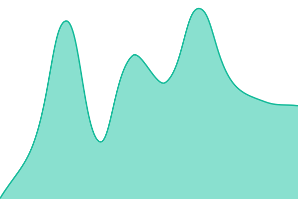 219ms
     
 | 

<a href="https://status.unosquare.com/history/vacation-approvals-satellite">100.00%</a>
    

<!--end: status pages-->

[**Visit our status website →**](https://upptime.github.io/upptime)

## 📄 License

- Powered by: [Upptime](https://github.com/upptime/upptime)
- Code: [MIT](./LICENSE) © [Anand Chowdhary](https://anandchowdhary.com), supported by [Pabio](https://pabio.com)
- Data in the `./history` directory: [Open Database License](https://opendatacommons.org/licenses/odbl/1-0/)
